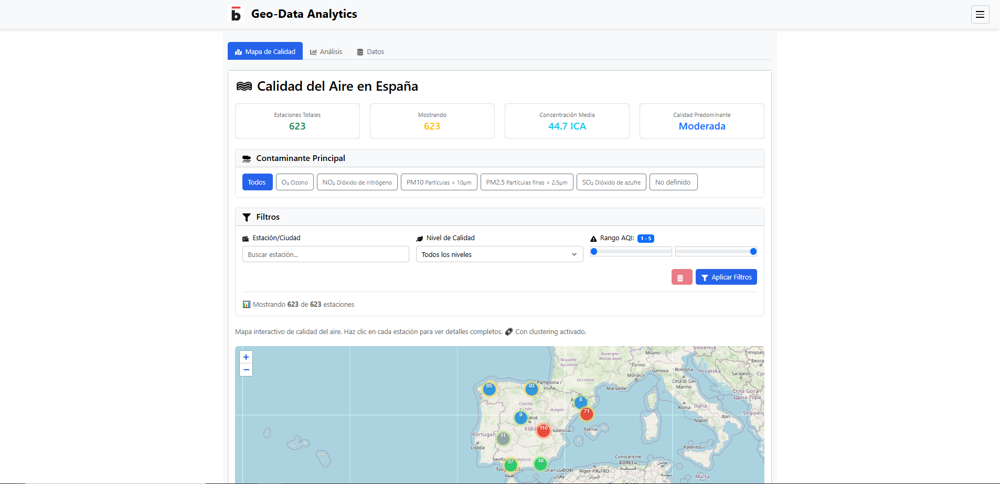
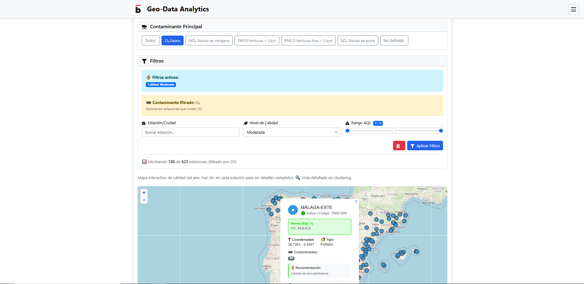
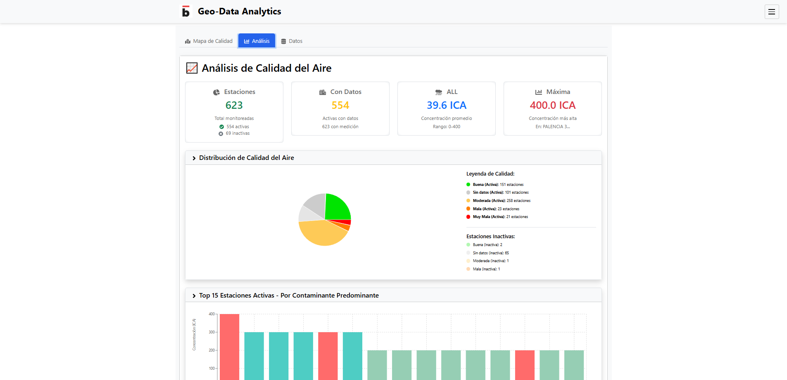
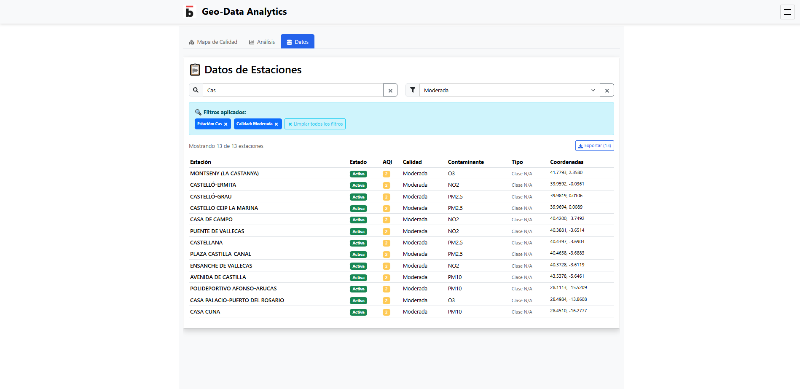
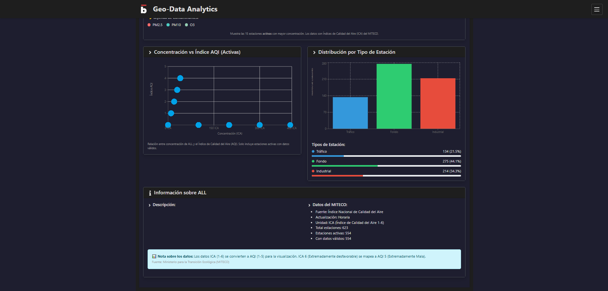
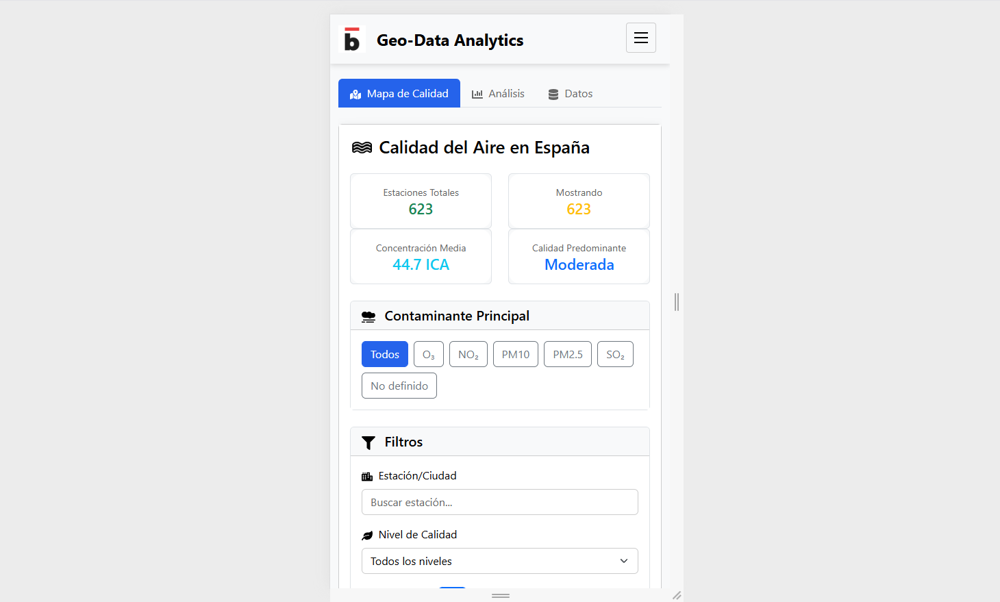

# 🌍 GEO-DATA ANALYTICS
Aplicación de visualización geoespacial y análisis temporal.


## 🚀 CARACTERÍSTICAS  
- **Dashboard inicial:** Selección de datasets con cards interactivas
- **Arquitectura modular:** Componentes separados (Dashboard, Dataset, Header, Footer)
- **Routing profesional:** React Router con navegación entre vistas
- **Sistema de temas:** Claro/oscuro con persistencia en localStorage
- **Vistas específicas por dataset:** Mapa, Gráficos y Datos en tabs
- **Caché inteligente:** Postgres con 24h TTL + histórico de snapshots
- **Backend FastAPI:** Con filtros avanzados, estadísticas y caching
- **Frontend React:** TypeScript, Bootstrap 5, Leaflet, Recharts
- **Análisis multi-dimensionales:** Por región, período y tipo


## 📊 DATASETS INCLUIDOS  
1. **COVID España** - Casos por comunidad autónoma y provincia (2023)
2. **Clima España** - Condiciones meteorológicas actuales en ciudades españolas (OpenWeatherMap API)
3. **Elecciones España** - Resultados Generales 2023 por partido político
4. **Calidad del Aire España** - Mapa de calidad del aire actual en ciudades españolas (MITECO API)
5. **Vivienda España** - Índice de Precios de Vivienda en España (INE API)


## 🛠️ TECNOLOGÍAS  
- **Frontend:** React 18, TypeScript, Vite, Bootstrap 5, Leaflet, Recharts, React Router
- **Backend:** FastAPI, Python 3.11, SQLAlchemy, GeoAlchemy2, Pandas
- **Base de datos:** PostgreSQL 15 + PostGIS 3.3
- **Caché:** Postgres con TTL automático y snapshots históricos
- **Infraestructura:** Docker, Docker Compose, Nginx
- **APIs externas:** OpenWeatherMap (datos meteorológicos), INE (Índice de Precios de Vivienda), MITECO (calidad del aire)


## 🐳 INICIO RÁPIDO CON DOCKER  
### 1. Clonar repositorio
```bash
git clone <url>
cd geo-data
```
### 2. Configurar variables (opcional)
```bash
cp .env.example .env
```
### 3. Levantar servicios
```bash
docker-compose up -d
```
### 4. Acceder  
✅ Frontend en http://localhost:8180  
✅ API a través de Nginx en http://localhost:8180/api/*  
✅ Swagger docs en http://localhost:8180/api/docs  
✅ Backend directo en http://localhost:8100 (para desarrollo)  
✅ Base de datos en localhost:5440  

🔧 Configuración API Clima  
Para usar datos en tiempo real de OpenWeatherMap:  
Regístrate en OpenWeatherMap  
Obtén tu API Key gratuita  
Edita .env en backend:  
```text  
OPENWEATHER_API_KEY=tu_api_key_aquí  
```  


## 🧪 DESARROLLO LOCAL  
### Backend:  
```bash  
cd backend  
python -m venv venv  
source venv/bin/activate  
pip install -r requirements.txt  
uvicorn app.main:app --host 0.0.0.0 --port 8100 --reload  
```  

### Frontend:  
```bash  
cd frontend  
npm install  
npm run dev  
```  


## 📁 ESTRUCTURA  
geo-data/  
├── docker-compose.yml  
├── .env.example  
├── backend/  
│   ├── app/  
│   │   ├── main.py  
│   │   ├── database.py  
│   │   ├── models/  
│   │   │   ├── covid.py  
│   │   │   └── housing.py  
│   │   ├── routers/  
│   │   │   ├── covid.py  
│   │   │   ├── weather.py  
│   │   │   ├── elections.py  
│   │   │   ├── air_quality.py  
│   │   │   └── housing.py  
│   │   └── services/  
│   │       ├── housing_cache.py  
│   │       └── ...  
│   ├── requirements.txt  
│   └── Dockerfile  
├── frontend/  
│   ├── src/  
│   │   ├── components/  
│   │   │   ├── HousingChart.tsx  
│   │   │   ├── HousingDatasetView.tsx  
│   │   │   ├── HousingMapView.tsx  
│   │   │   ├── HousingTable.tsx  
│   │   │   └── ...  
│   │   └── pages/  
│   ├── package.json  
│   └── Dockerfile  
└── docker/  
    └── init-db.sql  


## 🔌 ENDPOINTS API
**Health & Meta**

- `GET /` - Estado del API
- `GET /health` - Health check
- `GET /api/datasets` - Lista de datasets disponibles

**COVID**

- `GET /api/covid/data` - Todos los datos COVID
- `GET /api/covid/stats` - Estadísticas agregadas
- `GET /api/covid/filter` - Filtrado avanzado

**Clima**

- `GET /api/weather/data` - Datos meteorológicos
- `GET /api/weather/stats` - Estadísticas meteorológicas

**Elecciones**

- `GET /api/elections/data` - Resultados electorales
- `GET /api/elections/stats` - Estadísticas electorales
- `GET /api/elections/party/{partido}` - Resultados por partido

**Calidad del Aire**

- `GET /api/air-quality/stations` - Estaciones disponibles
- `GET /api/air-quality/station/{station_id}` - Datos de estación específica
- `GET /api/air-quality/stats` - Estadísticas agregadas
- `GET /api/air-quality/pollutants` - Información contaminantes

**Vivienda**

- `GET /api/housing/data` - Datos filtrados y paginados (con caché)

  - Query params: metric, housing_type, ccaa, anio_desde, anio_hasta, limit, offset
  - Response incluye campo source: "cache" o "ine"


- `GET /api/housing/metadata` - Metadatos del dataset
- `GET /api/housing/health` - Health check del servicio

**Documentación**

- `GET /api/docs` - Swagger UI interactivo


## 📊 CACHÉ DE DATOS
### Arquitectura (Dataset Vivienda)
El dataset de Vivienda implementa un sistema de caché inteligente en Postgres:

**Tablas:**

  - housing_ine_cache - Datos actuales (se sobrescribe cada 24h)
  - housing_ine_snapshots - Histórico completo (crece indefinidamente)

**Flujo:**

1. Primera request: Descarga del INE → guarda en housing_ine_cache (~5-10s)
2. Requests siguientes (24h): Consulta housing_ine_cache (~100ms)
3. Después de 24h:

    - Crea snapshot del contenido actual → housing_ine_snapshots
    - Borra housing_ine_cache
    - Descarga nuevos datos del INE
    - Vuelve al paso 2

**Beneficios:**

✅ Reduce dependencia de API externa (INE)  
✅ Performance ~100x más rápido (caché vs API)  
✅ Histórico persistente para comparativas futuras  
✅ Auto-refresh automático cada 24h  


## 🚢 DESPLIEGUE  
```bash  
docker-compose up -d --build  
```  
Variables .env:  
```  
DB_USER=geodata  
DB_PASSWORD=tu_password_seguro  
DB_NAME=geodata_prod  
API_URL=http://localhost:8180/api  
```  


## 📈 Próximas características  
Más datasets (turismo, economía, demografía)
Análisis predictivo básico
Exportación de datos (PDF, PNG)
Autenticación de usuarios
Panel de administración
Comparativas temporales automáticas (snapshots)
Alertas por anomalías
API de terceros (webhooks)


## 🤝 Contribuir  
Fork el proyecto  
Crear rama (git checkout -b feature/nueva-funcionalidad)   
Commit cambios (git commit -am 'Añadir funcionalidad')  
Push a la rama (git push origin feature/nueva-funcionalidad)  
Crear Pull Request  


## 📄 Licencia  
MIT License - ver LICENSE para más detalles.  


## 📸 Capturas de pantalla  

<table>
  <tr>
    <td align="center" width="33%">
      <strong>Vista general del mapa</strong><br>
      <br>      
    </td>
    <td align="center" width="33%">
      <strong>Filtros activos en mapa</strong><br>
      <br>      
    </td>
    <td align="center" width="33%">
      <strong>Pestaña análisis (gráficos)</strong><br>
      <br>      
    </td>
  </tr>
  <tr style="background-color: #f6f8fa">
    <td align="center" width="33%">
      <strong>Pestaña datos con filtros</strong><br>
      <br>      
    </td>
    <td align="center" width="33%">
      <strong>Tema claro/oscuro</strong><br>
      <br>      
    </td>
    <td align="center" width="33%">
      <strong>Vista responsive (mobile)</strong><br>
      <br>      
    </td>
  </tr>
</table>
